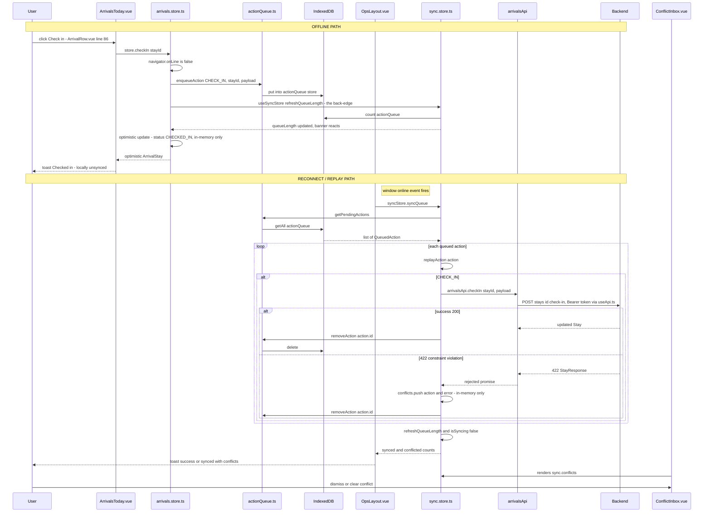

# Research: Przepływ ops ↔ arrivals/inhouse (offline sync engine)

**Date**: 2026-09-14T20:04:00+02:00
**Researcher**: Claude Sonnet 5
**Git Commit**: 570d43b1067a853749a6fc9c04d850d3235f55fa
**Branch**: main
**Repository**: beduno-fe

## Research Question

> Badamy jedyny realny przepływ w systemie na ten moment. Jest on kluczowy dla działania całego
> systemu. Przeanalizuj wybrany przepływ, zwracając szczególną uwagę na powiązane z nim obszary
> zdefiniowane w `context/map/repo-map.md`.

Wybrany przepływ (per `context/map/repo-map.md`, sekcja "Jedyny realny cykl: `ops ↔ arrivals` /
`ops ↔ inhouse`"): silnik offline sync w `src/modules/ops/store/sync.store.ts`, który replayuje
zakolejkowane akcje (`CHECK_IN`/`CHECK_OUT`/`MOVE`/`NO_SHOW`) po powrocie online, oraz krawędź
powrotna z `arrivals.store.ts`/`inhouse.store.ts` do `useSyncStore()`.

Trzy wymiary analizy (jak zlecono):
1. **Trace e2e** — pełna ścieżka od UI entry pointu przez warstwy do zapisu/odczytu i z powrotem.
2. **Luki w testach** — pokrycie metod/gałęzi na tej ścieżce.
3. **Blast radius** — co zmienia się razem (graf statyczny + co-change z historii gita).

## Summary

Przepływ jest w pełni działający i spójny z realnym kontraktem API (zero driftu wobec
`openapi.yaml` na dziś — ostatnio zreconcilowany w `c11add5`, tego samego dnia). Cykl
`ops ↔ arrivals/inhouse` z `repo-map.md` jest potwierdzony w kodzie i ma dokładnie jedną
przyczynę: `queueOffline()` w obu store'ach woła `useSyncStore().refreshQueueLength()` wyłącznie
po to, by licznik w `OfflineBanner.vue` odświeżył się natychmiast, a nie dopiero po reconnect.
Nie ma żadnej zależności funkcjonalnej w drugą stronę poza tym jednym wywołaniem.

Największy realny dług: **conflict inbox (`sync.store.ts`'s `conflicts` ref) istnieje wyłącznie
w pamięci Pinia — zero object store w IndexedDB (`db.ts`)**. To dokładnie odpowiada Risk #3 z
`context/foundation/test-plan.md` (High impact / Medium likelihood, Phase 3 "Offline durability"
= `not started`). Drugi po nim: `actionQueue.ts` nie ma ani jednego testu przeciw prawdziwemu
IndexedDB — każdy konsument mockuje cały moduł, więc kolejność replay (FIFO) nigdy nie jest
faktycznie zweryfikowana. Trzeci: zero pokrycia E2E dla ścieżki offline w ogóle — żaden Playwright
spec nie wchodzi w tryb offline.

## Feature overview

### Co to za funkcja

Front-desk (`PROPERTY_ADMIN`/`FRONT_DESK`, wymuszone przez `meta.roles` na `/ops/*` —
[`src/app/router/index.ts:28-30`](../../../src/app/router/index.ts)) wykonuje operacyjne akcje na
pobycie gościa (check-in, no-show, move w Arrivals; check-out, move w In-House) z poziomu PWA,
które musi działać także bez łącza. Offline: akcja trafia do kolejki w IndexedDB i (w arrivals)
UI aktualizuje się optymistycznie. Po powrocie online: `ops`'s `sync.store.ts` replayuje kolejkę
przeciw prawdziwemu API; sukces usuwa wpis z kolejki, odrzucenie (np. 422 z silnika ograniczeń
backendu) trafia do **conflict inbox** — nigdy nie jest cicho scalane ani ponawiane automatycznie
(zgodnie z twardą regułą CLAUDE.md "Propose → confirm" / "never silently auto-merge").

### Sekwencja end-to-end (evidence, file:line)

**A. UI entry points**
1. `src/modules/arrivals/components/ArrivalRow.vue:86` — check-in click → emit; `:94` no-show; `:102` move. **[ast-grep correction]** These are not the only entry points: `ArrivalRow.vue:49` and `:57` emit the identical `check-in`/`no-show` events from a `useSwipe` gesture handler (swipe-right → check-in, swipe-left → no-show, `ArrivalRow.vue:42-58`) — a second, parallel UI path into the same store actions, missed in the original pass.
2. `src/modules/arrivals/views/ArrivalsToday.vue:67-75` — `handleDirectCheckIn` → `store.checkIn(stayId)`.
3. `src/modules/inhouse/components/RoomCard.vue:127` — check-out emit; `:36` move-room emit. `RoomCard.vue:74` also emits `toggle-select`, which feeds `InHouseView.vue`'s `selectedStayIds` set and the "bulk check-out" button → `store.bulkCheckout()` — the one action confirmed to have no offline branch at all (see Technical debt §3).
4. `src/modules/inhouse/views/InHouseView.vue:32-49` — `handleCheckOut`/`handleMoveRoom` → store actions.

**B. OFFLINE — enqueue + optimistic update**
5. `src/modules/arrivals/store/arrivals.store.ts:58-72` (`checkIn`) — `!navigator.onLine` check → `queueOffline('CHECK_IN', stayId, payload)`.
6. `arrivals.store.ts:53-56` (`queueOffline`) — `enqueueAction(...)` **then** `useSyncStore().refreshQueueLength()` — this is the back-edge.
7. `src/shared/services/actionQueue.ts:20-42` (`enqueueAction`) — `openDb()` → builds `QueuedAction` with id `${Date.now()}-${random}` → `put()` into `actionQueue` IDB store.
8. `src/shared/services/db.ts:11-60` (`openDb`/`onupgradeneeded`) — `DB_VERSION = 3`; stores `workers`/`rooms`/`arrivals`/`meta` (v1), `actionQueue` (v2); v3 migrates the `arrivals` store's index `workerInternalId` → `workerId`, gated on `e.oldVersion`.
9. `arrivals.store.ts:61-67` — optimistic update: clones the stay with `status: 'CHECKED_IN'` into in-memory Pinia state only (no IDB write of the snapshot). Same pattern for `noShow` (`:74-88`, → `NO_SHOW`) and `move` (`:90-107`, → `CHECKED_OUT` as "closest local approximation" per inline comment, since a real move is check-out-old + create-new server-side).
10. `src/modules/inhouse/store/inhouse.store.ts:65-72` (`checkOut`) / `:74-81` (`moveRoom`) — same offline check + `queueOffline`, **but no optimistic update at all**: `rooms.value` is untouched until the next `fetchInHouse()`. Asymmetry vs. arrivals.
11. `inhouse.store.ts:83-87` (`bulkCheckout`) — **no `navigator.onLine` check at all**; always calls the API directly, not queue-aware.
12. `src/modules/ops/components/OfflineBanner.vue:9-27` — listens to `online`/`offline`; renders queue count via `sync.queueLength`.

**C. ONLINE — direct API call**
13. `arrivals.store.ts:69-71` — online path calls `arrivalsApi.checkIn(stayId, payload)` directly.
14. `src/modules/arrivals/api/arrivals.api.ts:14-21` — `POST /stays/{id}/check-in` / `/no-show` / `/move`.
15. `src/modules/inhouse/api/inhouse.api.ts:11-20` — `POST /stays/{id}/check-out`, `/move`, `/stays/bulk-checkout`.
16. `src/shared/composables/useApi.ts:5-21,37-82` — shared axios instance; request interceptor attaches `Authorization: Bearer <token>`; response interceptor handles 401 via single queued refresh. **Same instance for online calls and replayed offline calls** — no separate/weaker auth path for replay.
17. `openapi.yaml:706-816` — backend contract: check-in/move document a `"422"` constraint-violation response (silnik ograniczeń, "re-submit with overrideReason to force"); check-out/no-show document `"200"`. (See Technical debt — spec-completeness gap.)

**D. RECONNECT / replay**
18. `src/shared/layouts/OpsLayout.vue:69` — `window.addEventListener('online', onOnline)` — **the actual sync trigger** (not `OfflineBanner.vue`, which only refreshes the counter on its own `online` listener).
19. `OpsLayout.vue:50-58` — `onOnline()` → `syncStore.syncQueue()` → toast `syncWithConflicts` or `syncComplete`.
20. `src/modules/ops/store/sync.store.ts:64-97` (`syncQueue`) — guards concurrent/offline; `getPendingActions()` (`actionQueue.ts:44-53`, `getAll()` on the IDB store); iterates in array order.
21. `sync.store.ts:34-57` (`replayAction`) — dispatch by `action.type`, confirmed via ast-grep to be exactly 4 `case` labels (`sync.store.ts:36,41,46,51`, no others): `CHECK_IN`/`NO_SHOW`/`MOVE` → `arrivalsApi.*`; `CHECK_OUT` → `inhouseApi.checkOut`. **`MOVE` always calls `arrivalsApi.move`** (ast-grep: exactly 2 call sites repo-wide — `arrivals.store.ts:104` online, `sync.store.ts:48` replay; zero `inhouseApi.move(...)` calls anywhere) regardless of arrivals- or inhouse-origin. **[ast-grep refinement]** `inhouse.api.ts:14-15` has its own, differently-named `moveRoom(stayId, payload)`, called only from `inhouse.store.ts:79` on the **online** path — it hits the byte-identical `POST /stays/${stayId}/move` endpoint as `arrivalsApi.move`, so the replay engine's decision to route every queued `MOVE` through `arrivalsApi.move` (never `inhouseApi.moveRoom`) is safe, but it means the offline queue silently normalizes two differently-named store methods into one API call at replay time — worth a code comment, since nothing documents this today.
22. `sync.store.ts:75-87` — success → `removeAction(id)` (`actionQueue.ts:55-64`, IDB delete), `synced++`. Failure (thrown, e.g. axios rejecting non-2xx) → pushed into `conflicts.value` (in-memory only) **and** removed from the queue in the same branch — never silently retried.
23. `sync.store.ts:90-94` — `finally`: `isSyncing = false`, `refreshQueueLength()` again.
24. `src/modules/ops/components/ConflictInbox.vue:11-45` — renders `sync.conflicts`; per-item `dismissConflict` (`sync.store.ts:99-101`) and bulk `clearConflicts` (`:103-105`) — the literal "Needs review" UI from CLAUDE.md's offline-support rule. Rendered globally inside `OpsLayout.vue:136`, visible across all `/ops/*` children.

**E. Back-edge — the cycle itself**
25. `arrivals.store.ts:13` / `inhouse.store.ts:8` — `import { useSyncStore } from '@/modules/ops/store/sync.store'`.
26. Sole call site in both: `queueOffline`'s `useSyncStore().refreshQueueLength()` — **ast-grep confirms exactly one `useSyncStore()` call site in each file, at `arrivals.store.ts:55` and `inhouse.store.ts:62`** (the original `:~62` estimate is now exact) — purely UX responsiveness for the banner counter. Neither store calls `syncQueue()` (ast-grep: zero hits outside `sync.store.spec.ts` and the sole production call at `OpsLayout.vue:51`), `replayAction()` (ast-grep: zero hits outside its one internal call at `sync.store.ts:76`), or reads `sync.conflicts` (ast-grep + grep: zero hits outside `ConflictInbox.vue:12,27` and `sync.store.spec.ts`). **This is the entire cycle** — one-directional-per-call, no functional/data dependency. **[ast-grep addition]** `useSyncStore` has three more consumers the static graph in Technical debt §5 originally missed: `OpsLayout.vue`, `ConflictInbox.vue`, and `OfflineBanner.vue` (all `.vue`, invisible to a `src/`-wide grep scoped to `.ts`) — none of them create a cycle (they're downstream-only), but the full importer count of `sync.store.ts` is 5 files, not 3. Relatedly, `refreshQueueLength()` itself has **6** production call sites, not the 3 implied by the narrative above: the self-call in `sync.store.ts:93` (`syncQueue`'s `finally`), the two back-edges here, plus `OpsLayout.vue:68` (`onMounted`), and `OfflineBanner.vue`'s own `onMounted` and `online`-listener calls (`OfflineBanner.vue:14,21`) — `OfflineBanner.vue` independently refreshes the counter on every reconnect, in parallel with (not instead of) `OpsLayout.vue`'s replay trigger, exactly as the original report's step 18 already anticipated ("not `OfflineBanner.vue`, which only refreshes the counter on its own `online` listener").

### Mermaid — sequence diagram



### Kontrakt (openapi.yaml vs hand-written types) — evidence

Wszystkie cztery akcje mapują się 1:1, bez driftu na dziś:

| Endpoint | `openapi.yaml` | FE type | Zgodność |
|---|---|---|---|
| `POST /stays/{id}/check-in` | `CheckInRequest {roomId?, bedId?, overrideReason?}` | `CheckInPayload` | ✅ pole w pole |
| `POST /stays/{id}/no-show` | `NoShowRequest {noShowReason (required)}` | `NoShowPayload {noShowReason: string}` | ✅ (walidacja `maxLength` nie jest reprezentowana w TS — oczekiwane) |
| `POST /stays/{id}/move` | `MoveRequest {targetRoomId (required), targetBedId?, overrideReason?}` | `MovePayload` | ✅ pole w pole |
| `POST /stays/{id}/check-out` | `CheckOutRequest {actualDateTo?}` | `CheckOutPayload` | ✅ |
| `POST /stays/bulk-checkout` | `BulkCheckoutRequest`/`Result` | `BulkCheckoutPayload`/`Response` | ✅ |

`StayResponse` ↔ `Stay` interface — zgodne pole w pole, w tym płaskie ID (bez nested obiektów),
zgodnie z regułą CLAUDE.md. To świeży stan — commit `c11add5` (2026-09-14, dziś, tip brancha)
zreconcilował `openapi.yaml` + `stay.types.ts`/`arrival.types.ts`/`inhouse.types.ts` +
`arrivals.api.ts`/`inhouse.api.ts` + odpowiednie `.spec.ts` w jednym commicie.

Generowany `src/shared/types/api-schema.d.ts` — **zero importerów w `src/`** (potwierdzone
grepem) — dokładnie zgodne z deklarowaną w CLAUDE.md rolą: referencja do diffowania, nie runtime
source of truth.

### Feature overview — Evidence / Inference / Unknown

**EVIDENCE**: kroki 1-26 to bezpośrednie odczyty kodu z file:line; tabela kontraktu to
bezpośrednie porównanie `openapi.yaml` z hand-written types.

**INFERENCE**:
- Kolejność replay jest w praktyce insertion-order, bo `getPendingActions()` używa `getAll()` bez
  jawnego sortowania, a klucz (`${Date.now()}-${random}` string) sortuje się leksykograficznie ≈
  chronologicznie dopóki liczba cyfr `Date.now()` się nie zmienia — kod nie wymusza tego jawnym
  indeksem/sortem po `queuedAt`.
- Asymetria inhouse (brak optymistycznej aktualizacji `rooms.value` przy offline check-out/move)
  jest prawdopodobnie świadomym uproszczeniem, bo `RoomOccupancy` agreguje wiele pobytów na
  pokój (trudniej bezpiecznie patchować po stronie klienta) vs. płaski `ArrivalStay` — to
  wnioskowanie z kształtu danych, nie stwierdzenie wprost w kodzie.

**UNKNOWN**:
- Realne zachowanie silnika ograniczeń backendu przy replay już-checked-in stay (422 vs
  idempotentne 200) — logika backendu, niewidoczna z tego repo.
- Czy `POST /stays/{id}/move`'s "atomic operation" faktycznie jest atomowe przy współbieżnym
  replay z dwóch urządzeń — semantyka transakcji backendu, nie da się zweryfikować z SPA.
- Czy ta ścieżka jest realnie używana w terenie (PWA na słabym Wi-Fi property) — brak telemetrii
  w repo.

## Technical debt

### 1. Conflict inbox nie przetrwa reloadu (największy, już nazwany dług)

`sync.store.ts:27` — `conflicts` to czysty `ref<SyncConflict[]>([])`, Pinia in-memory. `db.ts:22-
50` deklaruje tylko `workers`/`rooms`/`arrivals`/`meta`/`actionQueue` — **żadnego** object store
dla konfliktów. Odrzucona akcja znika bez śladu po reloadzie strony.

To dokładnie **Risk #3** z `context/foundation/test-plan.md` (High impact / Medium likelihood,
źródło: "Roadmap S-07 baseline finding"; response guidance: *"a rejected replayed action is still
visible and actionable after a page reload"* — obecny kod tego nie spełnia). **§3 Phased
Rollout, Phase 3 "Offline durability" (risks #3 i #4) ma status `not started`, change folder
pusty.** §6.2 cookbook: *"TBD — see §3 Phase 3."* Test plan sam trafnie ocenia lukę — to
potwierdzenie, nie nowe odkrycie.

**Co konkretnie trzeba zmienić, żeby to naprawić** (blast radius, evidence):
1. `db.ts` — bump `DB_VERSION` → 4, nowy `conflicts` object store (naturalny klucz: `action.id`,
   bo `SyncConflict` dziś nie ma własnego `id`), migracja gated na `e.oldVersion < 4` (zgodnie z
   twardą regułą CLAUDE.md — nie tylko `objectStoreNames.contains`).
2. `actionQueue.ts` (lub nowy sibling service, np. `conflictInbox.ts`) — CRUD funkcje analogiczne
   do `enqueueAction`/`getPendingActions`/`removeAction`.
3. `sync.store.ts` — `dismissConflict`/`clearConflicts`/push w `syncQueue()` muszą stać się async
   wywołaniami IndexedDB zamiast mutacji tablicy.
4. `ConflictInbox.vue` — jedyny konsument `conflicts`; przy zmianie kształtu wymaga przejścia na
   async load-on-mount (lub hybrydowo: Pinia ref hydrated z IDB przy inicjalizacji store'a).
5. `sync.store.spec.ts` — prawdopodobnie wymaga dodania IndexedDB-mockingu obok istniejącego
   mockowania `actionQueue` (nie zweryfikowano dokładnej strategii mockowania — **UNKNOWN**).

**Zero istniejącego testu (unit, component czy e2e) asercjonuje przetrwanie `conflicts` po
reloadzie** — potwierdzone grepem po wszystkich spec plikach dotykających `sync.store.ts`.

### 2. `actionQueue.ts` bez testów przeciw prawdziwemu IndexedDB

Każdy konsument (`sync.store.spec.ts`, `arrivals.store.spec.ts`, `InHouseView.spec.ts`,
`ArrivalsToday.spec.ts`) mockuje cały moduł `vi.fn()`. `enqueueAction`/`getPendingActions`/
`removeAction`/`getQueueLength` (`actionQueue.ts:20-86`) nigdy nie są wywoływane przeciw realnej
transakcji IDB — kolejność replay (FIFO przez `getAll()`) jest w testach ręcznie ułożonymi
tablicami mocków, nie odczytem z prawdziwego store'a, więc realny bug kolejności (np.
`getAll()` nie gwarantujące porządku insercji przy współbieżnych zapisach) nie zostałby wykryty.

**[ast-grep correction]** `clearQueue()` (`actionQueue.ts:66-75`) to nie tylko "brak testu" —
`ast-grep run -p 'clearQueue()' -l ts src/` zwraca **zero** wyników w całym `src/`, potwierdzone
klasycznym `grep -rn "clearQueue" src` (jedyne trafienie to własna definicja funkcji,
`actionQueue.ts:66`). To **martwy kod**: funkcja nie jest wywoływana ani przez produkcyjny kod,
ani przez żaden test, ani przez żaden komponent — nie tylko nietestowana ścieżka.

### 3. Asymetria arrivals vs. inhouse w offline UX i pokryciu

- `inhouse.store.ts`'s `checkOut`/`moveRoom` offline branches **nie robią optymistycznej
  aktualizacji** `rooms.value` (w przeciwieństwie do arrivals) — użytkownik offline-checkoutujący
  z widoku in-house nie widzi natychmiastowej zmiany UI aż do kolejnego `fetchInHouse()`.
- `inhouse.store.ts:83-87` (`bulkCheckout`) **nie ma w ogóle gałęzi offline** — zawsze woła API
  bezpośrednio, nie jest częścią systemu kolejkowania, mimo sąsiedztwa z `checkOut`/`moveRoom`.
  **[ast-grep addition]** To nie jest martwa ścieżka teoretyczna: `RoomCard.vue:74` emituje
  `toggle-select`, które zasila `InHouseView.vue`'s `selectedStayIds` (linie 18,52-55) i przycisk
  "bulk check-out" (linie 60-64) wołający `store.bulkCheckout([...selectedStayIds.value])` — realny
  gest front-desku (zaznacz wiele pokoi → bulk check-out) prowadzi wprost do akcji, która offline
  po prostu zawiedzie zamiast trafić do kolejki.
- **Brak `inhouse.store.spec.ts` w ogóle** (potwierdzone `find`) — arrivals ma dobre pokrycie
  unit-testami swoich offline gałęzi (`checkIn`/`noShow`/`move` — `arrivals.store.spec.ts:87-184`),
  inhouse — zero, na żadnej warstwie.
- Rzeczywisty trigger reconnect (`OpsLayout.vue`'s `online` listener → `onOnline()` →
  `syncQueue()`, plus branching na toast `syncComplete` vs `syncWithConflicts`) jest **całkowicie
  nietestowany** — nie istnieje `OpsLayout.spec.ts`.
- `ConflictInbox.vue` i `OfflineBanner.vue` — **zero component spec** dla żadnego z nich.
- `db.ts`'s `onupgradeneeded` (v1→v2→v3, w tym zamiana indeksu `workerInternalId`→`workerId`)
  jest **całkowicie nietestowana** — regresja migracji (np. dla użytkownika z istniejącą bazą
  v1/v2) nie zostałaby wykryta przez żaden obecny test.

### 4. Zero pokrycia E2E dla ścieżki offline

Grep po wszystkich `e2e/*.spec.ts` po `offline`/`online`/`setOffline`/queue/conflict-related
terminach — **zero trafień**. Wszystkie istniejące specs (`arrival-day.spec.ts`,
`nightly-list.spec.ts`, `stay-lifecycle.spec.ts`, `inspection-day.spec.ts`, `checkin.spec.ts`,
`smoke.spec.ts` i inne) działają wyłącznie w trybie online przeciw żywemu `beduno-be`. **Żaden
spec nie wchodzi w offline, nie kolejkuje akcji, nie wraca online i nie asercjonuje replay.**

Spec zaprojektowany dokładnie do tego (`e2e/offline-arrival-day.spec.ts`) **nie istnieje na
dysku** — istnieje wyłącznie jako niezaimplementowany plan w
`context/changes/arrival-day-proven/plan.md`:
- Status `planned`, **Progress: 0/8 checkboxów odhaczonych** — nic nie jest zaimplementowane.
- Plan sam jawnie wyłącza ze scope'u przetrwanie konfliktu po reloadzie (`plan.md:79-85`) —
  deferowane do wciąż-niezaczętej Fazy 3. Nawet po implementacji ten plan udowodniłby tylko
  ścieżkę sukcesu replay, nie zamknąłby luki #1 powyżej.
- Drobny dryf w samym planie: snippet IDB otwiera `indexedDB.open('beduno-offline', 2)`, podczas
  gdy aktualny `db.ts:7` ma `DB_VERSION = 3` — do poprawki przed użyciem tego planu.
- Ten sam zewnętrzny bloker co inne strumienie E2E: `E2E_TEST_EMAIL`/`E2E_TEST_PASSWORD` repo
  secrets wciąż nieprowizjonowane (potwierdzone `gh secret list`).

### 5. Blast radius — co zmienia się razem (graf statyczny + co-change z historii gita)

**Graf statyczny (runtime, nie type-only), evidence z grepa:**

```
db.ts            ← actionQueue.ts, offlineDb.ts
actionQueue.ts   ← sync.store.ts, arrivals.store.ts, inhouse.store.ts (+ ich .spec.ts)
offlineDb.ts     ← useOfflineSnapshot.ts, ArrivalsToday.vue
sync.store.ts    ← OpsLayout.vue, arrivals.store.ts, inhouse.store.ts  (runtime)
                 ← arrivalsApi, inhouseApi                              (runtime, wychodzące)
arrivals.api.ts  ← arrivals.store.ts, sync.store.ts
inhouse.api.ts   ← inhouse.store.ts, sync.store.ts
stay.types.ts    → (type-only) re-exportowany przez arrival.types.ts / inhouse.types.ts
api-schema.d.ts (generowany) ← ZERO importerów w src/ (potwierdza rolę "diff-only reference")
```

**Co-change z historii gita** (7 unikalnych commitów dotykających `sync.store.ts` /
`arrivals.store.ts` / `inhouse.store.ts`, 2026-04-14 → 2026-09-14 — cały silnik ma ~5 miesięcy):

| Commit | Data | Temat | Co jeszcze dotknięte |
|---|---|---|---|
| `92789b9` | 2026-04-14 | add sync engine: replay queued offline actions on reconnect | `sync.store.ts`, `OpsLayout.vue` |
| `96cbb69` | 2026-04-14 | sync completion toast with conflict count | `sync.store.ts`, `OpsLayout.vue`, **5 plików tłumaczeń** |
| `5b2256f` | 2026-04-14 | offline action queue: enqueue check-in/out/move/no-show | `arrivals.store.ts`, `inhouse.store.ts`, `actionQueue.ts`, `db.ts`, `offlineDb.ts` |
| `6c11c61` | 2026-04-14 | arrivals today module (check-in, no-show, QR, move) | `arrivals.api.ts`, komponenty arrivals, `arrival.types.ts`, router, **5 plików tłumaczeń** |
| `5099ac8` | 2026-04-14 | in-house Pinia store | `inhouse.store.ts` samodzielnie |
| `ee19f04` | 2026-08-09 | refresh offline queue counter when actions are queued | `arrivals.store.ts`, `inhouse.store.ts`, `arrivals.store.spec.ts` — **ten commit domknął cykl** (per `artifact-3-contributors.md`) |
| `c11add5` | 2026-09-14 | sync frontend contract to real beduno-be OpenAPI spec | 69 plików — mega-reconciliation całego repo, nie specyficzny dla sync |

Sygnał: **5 plików tłumaczeń** współwystępuje z sync/arrivals zmianami w 3 z 7 commitów —
bezpośrednie potwierdzenie w historii gita reguły CLAUDE.md "every user string → all five
translation files". `db.ts` współwystąpił tylko raz — przy tworzeniu store'ów (`5b2256f`) — nikt
od tamtej pory nie zmieniał schematu IDB, co pasuje do faktu, że conflict inbox nigdy nie
dostał własnego store'a.

**"Jeśli dotykasz X, prawdopodobnie musisz dotknąć też" (synteza static+historical):**
- **Nowy typ zakolejkowanej akcji** → `actionQueue.ts` (`QueuedActionType` union) + oba store'y
  (jedyni dwaj producenci) + `replayAction`'s switch + odpowiedni `*Api` moduł + `ConflictInbox.vue`
  (jedyny konsument kształtu konfliktu) + `sync.store.spec.ts`/`arrivals.store.spec.ts` (jeden
  `it()` per typ akcji) + 5 plików tłumaczeń (jeśli akcja produkuje user-facing toast).
- **Zmiana kontraktu payload/response dla którejkolwiek z 4 akcji** → `openapi.yaml` (hand-copied
  z `beduno-be`) → `npm run generate:api-types` → diff vs `stay.types.ts` → propagacja do
  `arrival.types.ts`/`inhouse.types.ts` (cienkie re-eksporty) → `arrivals.api.ts`/`inhouse.api.ts`
  → `sync.store.ts`'s type casty w `replayAction` → optymistyczne update'y w obu store'ach
  (hardkodowane przejścia statusów jak `'CHECKED_IN'`) → 4 pliki spec → e2e specs dotykające tych
  flow (nie zweryfikowano treści — **INFERENCE**).

**Kolizja nazewnicza #1 (uwaga, nie duplikat kodu):** `'NO_SHOW'` jest wspólnym string-literalem
między `QueuedActionType` (`actionQueue.ts:8`, ten przepływ) a `StayStatus` (inny enum) —
**ast-grep/grep potwierdza i doprecyzowuje pełną listę wystąpień**: `actionQueue.ts:8` (definicja
typu akcji), `sync.store.ts:41` (case w replay), `stays/types/stay.types.ts:6` (definicja
`StayStatus`), `audit/types/audit.types.ts:9`, `auth/api/dashboard.api.ts:28`,
`stays/views/StayPlanner.vue:46`, plus użycia jako fixture w `arrivals.store.spec.ts` (linie
122,128,129,137,145,146,226) i `sync.store.spec.ts:111`. Realne, ale przypadkowe nakładanie się;
konieczna uwaga przy find-and-replace na kontrakcie akcji.

**Kolizja nazewnicza #2 (nowa, znaleziona przez ast-grep, nie w oryginalnym przebiegu):** słowo
"conflicts" oznacza w tym repo **dwa całkowicie niezwiązane podsystemy**. `grep -rn "\.conflicts\b"
src --include="*.vue"` (uzupełniające ast-grep, bo `.vue` nie jest wspieranym językiem) zwraca, obok
oczekiwanego `ConflictInbox.vue:12,27` (offline sync, przedmiot tego researchu), także
`src/modules/stays/components/ConflictBanner.vue` — zupełnie inny feature: renderuje
`hardViolations`/`softViolations` typu `ConstraintViolation` (`stays/types/stay.types.ts`) przy
tworzeniu/edycji pobytu (silnik ograniczeń "Propose → confirm" z CLAUDE.md), używany w
`StayDetail.vue`, `CreateStay.vue`, `BulkAssign.vue`, wspierany przez własny composable
`stays/composables/useConflicts.ts` (+ `useConflicts.spec.ts`). **Żadna z tych dwóch ścieżek nie
importuje ani nie odwołuje się do drugiej** (potwierdzone — `sync.store.ts` i `ConflictInbox.vue`
nie importują niczego z `modules/stays`, i odwrotnie) — to czysto nazewnicza kolizja domenowa, nie
sprzężenie kodu, ale warta zapisania: ktoś szukający "gdzie jest logika konfliktów" w tym repo
trafi na dwie niepowiązane odpowiedzi.

### Technical debt — Evidence / Inference / Unknown

**EVIDENCE**: pełny tekst `sync.store.ts`, `actionQueue.ts`, `db.ts`, `offlineDb.ts`,
`arrivals.store.ts`, `inhouse.store.ts`, `OpsLayout.vue:1-75`; pełny tekst `sync.store.spec.ts` i
`arrivals.store.spec.ts`; bloki mocków `InHouseView.spec.ts`/`ArrivalsToday.spec.ts`; potwierdzony
grepem/`find` brak `inhouse.store.spec.ts`, `OpsLayout.spec.ts`, `db.spec.ts`, `offlineDb.spec.ts`,
`actionQueue.spec.ts`, component specs dla `ConflictInbox.vue`/`OfflineBanner.vue`; grep po
`e2e/*.spec.ts` (zero trafień na offline/sync/conflict/queue); pełny tekst
`context/foundation/test-plan.md` i `context/changes/arrival-day-proven/{change.md,plan.md}`;
7-commitowa tabela co-change z bezpośredniego `git log`/`git show --stat`; porównanie
`openapi.yaml` vs hand-written types (zero driftu).

**INFERENCE**:
- Luka #1 (conflict inbox) jest najbardziej ryzykowna, bo to scenariusz utraty danych w systemie,
  którego CLAUDE.md nazywa twardą regułą "Everything is audited" — cicho znikająca odrzucona akcja
  bezpośrednio przeczy temu niezmiennikowi; autorzy `test-plan.md` niezależnie doszli do tego
  samego wniosku.
- Wzorzec pełnego mockowania `actionQueue.ts` (luka #2) jest ryzykiem umiarkowanym, nie
  krytycznym w praktyce — semantyka IndexedDB `getAll()` jest prosta i ugruntowana — ale oznacza,
  że regresja we własnej logice `actionQueue.ts` (np. kolizja ID w schemacie `Date.now()-random`,
  albo zepsuta transakcja) ujawniłaby się dopiero na produkcji lub w (niezaimplementowanym) e2e
  specu.
- Czy mockowane w `sync.store.spec.ts` kształty błędów (`'Already checked in'`, itp.) odpowiadają
  realnym kształtom błędów `beduno-be` — niemożliwe do zweryfikowania z tego repo; ogranicza to,
  ile pewności daje w praktyce zielony test "moves failed action to conflict inbox".
- Większość komponentów UI arrivals/inhouse (poza wymienionymi) prawdopodobnie importuje
  odpowiednie store'y (taki jest cel modułu), ale nie zweryfikowano tego grepem plik-po-pliku dla
  każdego komponentu.

**UNKNOWN**:
- Czy kształty błędów mockowane w testach odpowiadają realnym odpowiedziom `beduno-be` na konflikt
  replay (status HTTP, kształt body) — wymaga weryfikacji na żywym/staging backendzie lub jego
  specyfikacji błędów, nie ustalone w tym przebiegu.
- Czy IndexedDB `getAll()` w realnych przeglądarkach faktycznie zachowuje kolejność insercji przy
  dokładnych warunkach tej aplikacji (zapisy `put()` poza kolejnością, reload strony między
  zapisami) — zachowanie środowiska, niemożliwe do zweryfikowania z samego kodu źródłowego.
- Dlaczego `openapi.yaml`'s ścieżki `/check-in` i `/move` dokumentują tylko odpowiedź `"422"`, a
  nie `"200"` (w przeciwieństwie do `/check-out` i `/no-show`) — może to być celowe przycięcie
  snapshotu specyfikacji backendu, a nie realna luka w runtime; do zweryfikowania przy najbliższym
  odświeżeniu `openapi.yaml`.
- Czy ten przepływ jest realnie eksploatowany w terenie (PWA na niestabilnym Wi-Fi property) —
  brak telemetrii w repo.
- Dokładna strategia mockowania w `sync.store.spec.ts` (mock modułu `actionQueue` vs. fake IDB) —
  potwierdzone istnienie mocków, nie zweryfikowano w pełni ich mechanizmu dla ewentualnego
  rozszerzenia o test persystencji konfliktów.

## Weryfikacja strukturalna (ast-grep)

Wszystkie twierdzenia STRUKTURALNE z powyższych sekcji (liczność call-site'ów, "tylko tutaj",
"zawsze przez X", liczba gałęzi/case'ów) zostały wypisane i zweryfikowane narzędziem `ast-grep`
(TS/TSX/JS — `.vue` nie jest wspieranym językiem w ast-grep 0.45.3, więc pliki `.vue` zweryfikowano
klasycznym `grep`, jawnie oznaczone niżej). Każde ZERO zwrócone przez ast-grep potwierdzono
dodatkowo klasycznym grepem, żeby odróżnić realny brak wystąpień od złego wzorca/nieobsługiwanej
składni.

| # | Twierdzenie | Wzorzec / komenda | Wynik | Werdykt |
|---|---|---|---|---|
| 1 | `arrivals.store.ts`/`inhouse.store.ts` wołają `useSyncStore()` dokładnie raz każdy, wyłącznie dla `.refreshQueueLength()` | `ast-grep -p 'useSyncStore()' -l ts src/modules/arrivals src/modules/inhouse` | 2 trafienia: `arrivals.store.ts:55`, `inhouse.store.ts:62` | **POTWIERDZONE** (linia `:~62` doprecyzowana na `:62`) |
| 2 | `MOVE` w replayu zawsze przez `arrivalsApi.move`, nigdy `inhouseApi` | `ast-grep -p 'arrivalsApi.move($$$ARGS)'` / `-p 'inhouseApi.move($$$ARGS)'` | `arrivalsApi.move`: 2 trafienia (`arrivals.store.ts:104`, `sync.store.ts:48`); `inhouseApi.move`: **0** — potwierdzone grepem: `grep -rn "inhouseApi\.move"` → 0, istnieje tylko `inhouseApi.moveRoom` (`inhouse.store.ts:79`, ten sam endpoint `POST /stays/{id}/move`) | **DOPRECYZOWANE** — teza prawdziwa, ale `moveRoom` jako osobna, nieudokumentowana nazwa metody dla tego samego endpointu nie była wspomniana |
| 3 | `replayAction`'s switch ma dokładnie 4 gałęzie (`CHECK_IN`/`NO_SHOW`/`MOVE`/`CHECK_OUT`) | `grep -n "case '" src/modules/ops/store/sync.store.ts` (ast-grep pattern na `case '$TYPE':` dał ERROR node — nieobsługiwana składnia poza kontekstem `switch`) | 4 trafienia: linie 36,41,46,51 | **POTWIERDZONE** |
| 4 | `bulkCheckout` (`inhouse.store.ts:83-87`) nie ma sprawdzenia `navigator.onLine` | `ast-grep -p 'navigator.onLine' -l ts src/modules/arrivals/store/arrivals.store.ts src/modules/inhouse/store/inhouse.store.ts` | 3× w arrivals (59,75,91 = checkIn/noShow/move), 2× w inhouse (66,75 = checkOut/moveRoom), 0 w zakresie 83-87 | **POTWIERDZONE** |
| 5 | `openDb()` wołane tylko z `actionQueue.ts` i `offlineDb.ts` | `ast-grep -p 'openDb()' -l ts src/` | 5 trafień w `actionQueue.ts`, 4 w `offlineDb.ts`, 0 gdzie indziej | **POTWIERDZONE** |
| 6 | `enqueueAction` wołane tylko z `arrivals.store.ts` i `inhouse.store.ts` (1 call site każdy) | `ast-grep -p 'enqueueAction($$$ARGS)' -l ts src/` | 2 trafienia: `arrivals.store.ts:54`, `inhouse.store.ts:61` | **POTWIERDZONE** |
| 7 | `getPendingActions` wołane raz, tylko w `sync.store.ts` | `ast-grep -p 'getPendingActions()' -l ts src/` | 1 trafienie: `sync.store.ts:72` | **POTWIERDZONE** |
| 8 | `removeAction` wołane dwa razy, oba w `sync.store.ts` (ścieżka sukcesu + porażki) | `ast-grep -p 'removeAction($$$ARGS)' -l ts src/` | 2 trafienia: `sync.store.ts:77`, `sync.store.ts:85` | **POTWIERDZONE** |
| 9 | `clearQueue()` "nie jest referencjonowany przez żaden spec" | `ast-grep -p 'clearQueue()' -l ts src/` → 0; potwierdzone `grep -rn "clearQueue" src` | Oba narzędzia: 0 wywołań w całym `src/` — jedyne trafienie to własna definicja (`actionQueue.ts:66`) | **DOPRECYZOWANE** (obostrzone) — to nie luka testowa, to martwy kod: zero call site'ów w ogóle, nie tylko w testach |
| 10 | `DB_VERSION = 3` | `ast-grep -p 'const DB_VERSION = $VAL' -l ts src/shared/services/db.ts` | `db.ts:7` → `$VAL = 3` | **POTWIERDZONE** |
| 11 | `ConflictInbox.vue` to jedyny konsument `sync.conflicts` | `ast-grep -p '$X.conflicts' -l ts src/` (9 trafień, wszystkie w `sync.store.spec.ts`) + `grep -rn "\.conflicts\b" src --include="*.vue"` | `.vue`: `ConflictInbox.vue:12,27` (właściwy konsument) + `ConflictBanner.vue` (**inny podsystem** — patrz Technical debt, kolizja nazewnicza #2) | **DOPRECYZOWANE** — prawdziwe dla `sync.conflicts`, ale grep ujawnił niepowiązany drugi byt o tej samej nazwie w `modules/stays` |
| 12 | `api-schema.d.ts` (generowany) ma zero importerów w `src/` | `grep -rln "api-schema" src` (klasyczny grep — substring w stringu importu nie jest dobrze wyrażalny wzorcem ast-grep) | 0 plików | **POTWIERDZONE** (mocniej niż zakładano: string "api-schema" nie występuje nigdzie w `src/`, nie tylko brak `import`) |
| 13 | `syncQueue()` w kodzie produkcyjnym wołane tylko z `OpsLayout.vue` | `ast-grep -p 'syncQueue()' -l ts src/` (0, bo `.vue`) + `grep -rn "syncQueue()" src --include="*.vue"` + `ast-grep -p '$STORE.syncQueue()' -l ts src/` | Produkcyjnie: 1 trafienie (`OpsLayout.vue:51`); testowo: 12 trafień, wszystkie w `sync.store.spec.ts` | **POTWIERDZONE** |
| 14 | `replayAction()` wołane tylko wewnętrznie przez `syncQueue()` | `ast-grep -p 'replayAction($$$ARGS)' -l ts src/` + `grep -rn "replayAction" src --include="*.vue"` (0) | 1 trafienie: `sync.store.ts:76` | **POTWIERDZONE** |
| 15 | `'NO_SHOW'` to kolizja string-literalu między `QueuedActionType` a `StayStatus`, m.in. w `StayPlanner.vue`/`audit.types.ts`/`dashboard.api.ts` | `grep -rn "'NO_SHOW'" src --include="*.ts" --include="*.vue"` | 16 trafień w 8 plikach produkcyjnych/testowych (pełna lista w Technical debt) | **POTWIERDZONE**, doprecyzowane pełną listą file:line |
| 16 | UI entry pointy check-in/no-show to `ArrivalRow.vue:86/94/102` (kliknięcia) | `ast-grep -p "emit('$EVT', $$$ARGS)" -l ts src/modules/arrivals/components/ArrivalRow.vue` (0 — `.vue` nieobsługiwane) + `grep -n "emit(" src/modules/arrivals/components/ArrivalRow.vue` | 5 wywołań `emit`, nie 3: `:49,57` (gest `useSwipe`, swipe-right/left) + `:86,94,102` (kliknięcia) | **DOPRECYZOWANE** — brakujący drugi, równoległy entry point (gest) do tych samych akcji store'a |
| 17 | `refreshQueueLength()` ma call site'y głównie w back-edge (2) + `finally` (1) | `ast-grep -p 'refreshQueueLength()' -l ts src/` (1: `sync.store.ts:93`) + `grep -rn "refreshQueueLength" src --include="*.vue"` (3: `OpsLayout.vue:68`, `OfflineBanner.vue:14,21`) | Łącznie 6 call site'ów produkcyjnych, nie 3 | **DOPRECYZOWANE** — rdzeń twierdzenia o cyklu (arrivals/inhouse → ops) pozostaje prawdziwy, ale pełna liczba wywołań `refreshQueueLength` była zaniżona |
| 18 | `RoomCard.vue` emituje tylko `move-room` i `check-out` istotne dla tego przepływu | `grep -n "emit(" src/modules/inhouse/components/RoomCard.vue` | 3 emity: `move-room:36`, `toggle-select:74` (**nieudokumentowany**, zasila `bulkCheckout`), `check-out:127` | **DOPRECYZOWANE** — dodaje realną ścieżkę UI do luki #3 w Technical debt |
| 19 | Brak `inhouse.store.spec.ts`, `OpsLayout.spec.ts`, component spec dla `ConflictInbox.vue`/`OfflineBanner.vue`, `db.spec.ts`, `offlineDb.spec.ts`, `actionQueue.spec.ts` | `find src -iname "<nazwa>"` dla każdego z 7 plików | Wszystkie 7 zapytań: 0 wyników | **POTWIERDZONE** |
| 20 | Zero pokrycia E2E dla offline (żaden spec nie dotyka offline/online/setOffline) | `grep -rniE "offline|setOffline|\bonline\b" e2e --include="*.spec.ts"` | 0 trafień | **POTWIERDZONE** |

**Podsumowanie werdyktów**: 13 POTWIERDZONE bez zmian, 7 DOPRECYZOWANE (nowe fakty dodane, żadne
twierdzenie nie okazało się fałszywe), 0 OBALONE. Największa realna korekta: dwa nowe, nieopisane
wcześniej UI entry pointy (`ArrivalRow.vue`'s swipe gesty) i realna, nie-teoretyczna ścieżka do
luki `bulkCheckout` przez `RoomCard.vue`'s `toggle-select`; dodatkowo jedna nowa kolizja nazewnicza
("conflicts" w `stays` vs `ops`) nieobecna w oryginalnym przebiegu.

## Code References

GitHub permalinks pinned to `570d43b1067a853749a6fc9c04d850d3235f55fa` (pushed to `origin/main`):

- [`src/modules/arrivals/components/ArrivalRow.vue:86`](https://github.com/beduno-app/beduno-fe/blob/570d43b1067a853749a6fc9c04d850d3235f55fa/src/modules/arrivals/components/ArrivalRow.vue#L86) (also `:94` no-show, `:102` move) — check-in/no-show/move emit handlers
- [`src/modules/arrivals/views/ArrivalsToday.vue:67-139`](https://github.com/beduno-app/beduno-fe/blob/570d43b1067a853749a6fc9c04d850d3235f55fa/src/modules/arrivals/views/ArrivalsToday.vue#L67-L139) — direct check-in/no-show/move + QR flow, offline snapshot fallback
- [`src/modules/arrivals/store/arrivals.store.ts:13`](https://github.com/beduno-app/beduno-fe/blob/570d43b1067a853749a6fc9c04d850d3235f55fa/src/modules/arrivals/store/arrivals.store.ts#L13) (`useSyncStore` import), [`:53-114`](https://github.com/beduno-app/beduno-fe/blob/570d43b1067a853749a6fc9c04d850d3235f55fa/src/modules/arrivals/store/arrivals.store.ts#L53-L114) — `queueOffline`, `checkIn`/`noShow`/`move`, `updateStayInList`
- [`src/modules/arrivals/api/arrivals.api.ts:14-21`](https://github.com/beduno-app/beduno-fe/blob/570d43b1067a853749a6fc9c04d850d3235f55fa/src/modules/arrivals/api/arrivals.api.ts#L14-L21) — check-in/no-show/move HTTP calls
- [`src/modules/inhouse/components/RoomCard.vue:36,127`](https://github.com/beduno-app/beduno-fe/blob/570d43b1067a853749a6fc9c04d850d3235f55fa/src/modules/inhouse/components/RoomCard.vue#L36) — move-room/check-out emit handlers
- [`src/modules/inhouse/views/InHouseView.vue:32-49`](https://github.com/beduno-app/beduno-fe/blob/570d43b1067a853749a6fc9c04d850d3235f55fa/src/modules/inhouse/views/InHouseView.vue#L32-L49) — check-out/move-room handlers
- [`src/modules/inhouse/store/inhouse.store.ts:8`](https://github.com/beduno-app/beduno-fe/blob/570d43b1067a853749a6fc9c04d850d3235f55fa/src/modules/inhouse/store/inhouse.store.ts#L8) (`useSyncStore` import), [`:58-87`](https://github.com/beduno-app/beduno-fe/blob/570d43b1067a853749a6fc9c04d850d3235f55fa/src/modules/inhouse/store/inhouse.store.ts#L58-L87) — `queueOffline`, `checkOut`/`moveRoom`/`bulkCheckout`
- [`src/modules/inhouse/api/inhouse.api.ts:11-20`](https://github.com/beduno-app/beduno-fe/blob/570d43b1067a853749a6fc9c04d850d3235f55fa/src/modules/inhouse/api/inhouse.api.ts#L11-L20) — check-out/move/bulk-checkout HTTP calls
- [`src/shared/services/actionQueue.ts:20-86`](https://github.com/beduno-app/beduno-fe/blob/570d43b1067a853749a6fc9c04d850d3235f55fa/src/shared/services/actionQueue.ts#L20-L86) — `enqueueAction`/`getPendingActions`/`removeAction`/`getQueueLength`/`clearQueue`
- [`src/shared/services/db.ts:6-60`](https://github.com/beduno-app/beduno-fe/blob/570d43b1067a853749a6fc9c04d850d3235f55fa/src/shared/services/db.ts#L6-L60) — `DB_VERSION`, `openDb`, `onupgradeneeded` migrations
- [`src/shared/services/offlineDb.ts:42-84`](https://github.com/beduno-app/beduno-fe/blob/570d43b1067a853749a6fc9c04d850d3235f55fa/src/shared/services/offlineDb.ts#L42-L84) — `saveSnapshot`/`loadSnapshot`
- [`src/modules/ops/composables/useOfflineSnapshot.ts:8-24`](https://github.com/beduno-app/beduno-fe/blob/570d43b1067a853749a6fc9c04d850d3235f55fa/src/modules/ops/composables/useOfflineSnapshot.ts#L8-L24) — `syncOfflineSnapshot`
- [`src/modules/ops/store/sync.store.ts:27`](https://github.com/beduno-app/beduno-fe/blob/570d43b1067a853749a6fc9c04d850d3235f55fa/src/modules/ops/store/sync.store.ts#L27) (`conflicts` ref), [`:30-105`](https://github.com/beduno-app/beduno-fe/blob/570d43b1067a853749a6fc9c04d850d3235f55fa/src/modules/ops/store/sync.store.ts#L30-L105) — `refreshQueueLength`, `replayAction`, `syncQueue`, `dismissConflict`, `clearConflicts`
- [`src/modules/ops/components/OfflineBanner.vue:9-27`](https://github.com/beduno-app/beduno-fe/blob/570d43b1067a853749a6fc9c04d850d3235f55fa/src/modules/ops/components/OfflineBanner.vue#L9-L27) — queue count / online-offline banner
- [`src/modules/ops/components/ConflictInbox.vue:11-45`](https://github.com/beduno-app/beduno-fe/blob/570d43b1067a853749a6fc9c04d850d3235f55fa/src/modules/ops/components/ConflictInbox.vue#L11-L45) — conflict inbox UI
- [`src/shared/layouts/OpsLayout.vue:44-69`](https://github.com/beduno-app/beduno-fe/blob/570d43b1067a853749a6fc9c04d850d3235f55fa/src/shared/layouts/OpsLayout.vue#L44-L69) (also `:136` `ConflictInbox` mount) — reconnect trigger, snapshot sync
- [`src/shared/composables/useApi.ts:5-82`](https://github.com/beduno-app/beduno-fe/blob/570d43b1067a853749a6fc9c04d850d3235f55fa/src/shared/composables/useApi.ts#L5-L82) — shared axios instance, auth interceptors
- [`src/app/router/index.ts:28-30`](https://github.com/beduno-app/beduno-fe/blob/570d43b1067a853749a6fc9c04d850d3235f55fa/src/app/router/index.ts#L28-L30) (also `:182-197` global guard) — `/ops/*` role gating
- [`openapi.yaml:706-816`](https://github.com/beduno-app/beduno-fe/blob/570d43b1067a853749a6fc9c04d850d3235f55fa/openapi.yaml#L706-L816) — check-in/check-out/move/no-show/bulk-checkout contract
- `context/foundation/test-plan.md` — Risk #3, §3 Phase 3 "Offline durability" (`not started`), §6.2 cookbook (`TBD`)
- `context/changes/arrival-day-proven/plan.md:79-85,156,304-327` — scoped-out conflict persistence, stale `DB_VERSION` in snippet, 0/8 Progress

## Architecture Insights

- **Cykl `ops ↔ arrivals/inhouse` ma dokładnie jedną, wąską przyczynę**: `refreshQueueLength()`
  wołane z `queueOffline()` w obu store'ach, wyłącznie dla natychmiastowej reaktywności licznika
  w banerze. Nie ma żadnej innej zależności funkcjonalnej w tę stronę — architektonicznie
  czystszym rozwiązaniem byłoby, żeby `enqueueAction` samo powiadamiało nasłuchujących (event/
  reactive store na poziomie `shared/`), zamiast bezpośredniego wywołania cross-module store'a —
  ale obecny kod bierze bezpośredni skrót.
- **Replay jest jednym punktem wejścia** (`OpsLayout.vue`'s `online` listener → `syncQueue()`) —
  `arrivals`/`inhouse` nigdy same nie inicjują replay, tylko piszą do kolejki i czytają licznik.
  To czyni `ops` module funkcjonalnie infrastrukturą (`shared`-like), nie routowanym feature'em —
  spójne z obserwacją z `artifact-2-structure.md` (`ops` ma 4/6 z oczekiwanego kształtu modułu).
- **Auth jest jednolite** dla online i replayowanych offline akcji — ten sam axios instance,
  interceptor, refresh-flow. Brak osobnej/słabszej ścieżki dla replay.
- **`MOVE`'s single-dispatch przez `arrivalsApi.move`** dla obu modułów-pochodzenia jest bezpieczne
  wyłącznie dlatego, że oba API wskazują na identyczny endpoint — implicit, nieudokumentowany
  invariant warty komentarza w kodzie, gdyby ktoś kiedyś rozdzielił te endpointy.

## Historical Context (from prior changes)

- `context/map/repo-map.md` — nazwał ten cykl jako jedyny realny w repo; ta analiza go potwierdza
  co do litery kodu.
- `context/map/artifact-2-structure.md` — graf zależności i klasyfikacja `ops` jako strukturalny
  wyjątek (brak `views`/`types`).
- `context/map/artifact-3-contributors.md` — chronologia: krawędź w przód (`92789b9`,
  2026-04-14, jedna sesja `sonnet-4.6`/`opus-4.6` w dniu przepisania) vs. krawędź powrotna
  (`ee19f04`, 2026-08-09, `opus-5`, wąska poprawka UX bez wzmianki o sprzężeniu modułów) — 4
  miesiące odstępu, dwie niezależne, słusznie zawężone decyzje.
- `context/foundation/test-plan.md` — Risk #3 dokładnie opisuje lukę conflict-inbox znalezioną tu
  w kodzie; Phase 3 rollout `not started`.
- `context/changes/arrival-day-proven/plan.md` — istniejąca, niezaimplementowana (0/8) próba
  udowodnienia ścieżki sukcesu replay przeciw żywemu API; jawnie wyłącza persystencję konfliktów
  ze swojego scope'u.

## Related Research

- `context/map/repo-map.md`, `context/map/artifact-1-territory.md`,
  `context/map/artifact-2-structure.md`, `context/map/artifact-3-contributors.md`
- `context/changes/testing-live-journey-beduno-be/research.md` (jeśli dotyczy pokrewnych ścieżek
  arrivals/inhouse/inspection przeciw żywemu API — nie odczytano w tym przebiegu)

## Open Questions

1. Czy warto persistować conflict inbox w IndexedDB teraz, czy poczekać na formalne rozpoczęcie
   Fazy 3 z `test-plan.md`? (Risk #3 jest już oceniony jako High/Medium — decyzja priorytetu do
   właściciela produktu.)
2. Czy asymetria arrivals/inhouse w optymistycznych update'ach offline (pkt. 3 w Technical debt)
   jest świadomym uproszczeniem, czy przeoczeniem wartym naprawy przy okazji następnej zmiany w
   `inhouse.store.ts`?
3. Czy `bulkCheckout` powinien dołączyć do systemu kolejkowania offline, czy pozostać
   celowo online-only (podobnie jak room/capacity/user edits, które CLAUDE.md explicite wyklucza
   z offline queue)?
4. Realny kształt błędu 422 z `beduno-be` przy replay-conflict — do zweryfikowania z zespołem
   backendu, żeby testy mockujące ten kształt (`sync.store.spec.ts`) nie mirror'owały wymyślonego
   stringa zamiast prawdziwego kontraktu.
